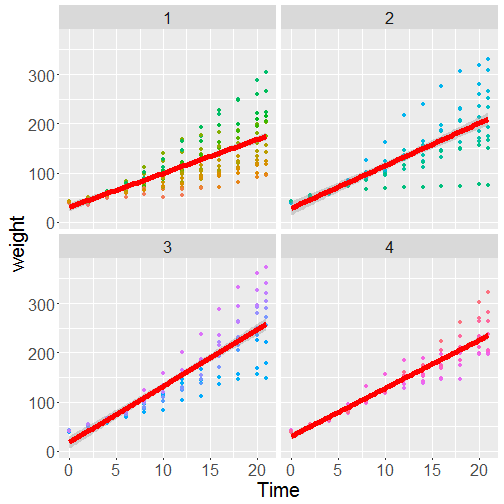

Exploratory Analysis App
========================================================
title       : Exploratory Analysis
author      : bandhafun
date        :Sun Apr 10 02:04:29 2016
autosize    : true

What does the App do?
========================================================

It is a User powered Exploratory analysis on the ChickWeight data.  

It has 3 Major Parts   

1. It renders Plots based on User input.  
2. It displays basic tables.  
3. It runs one line commands. 

User defined Plots
========================================================
It Takes inputs like 

1. Type of Graphs. : Point & Regression
2. X Axis  : Time
3. Y Axis  : weight
4. Panels  : Diet
5. Color   : Chick
6. Timeline : all

And plots accordingly
========================================================

Uses & Expansion Areas  
========================================================

It helps in visualising data with simple user inputs.It will cover most of the exploratory analysis.  
  
Expansion Areas  
1. Input data.    
2. Expanding command to more than one line command.   
3. Allow to reshape data

Check it Out  
https://bandhafunrho.shinyapps.io/PoltryDiet/
